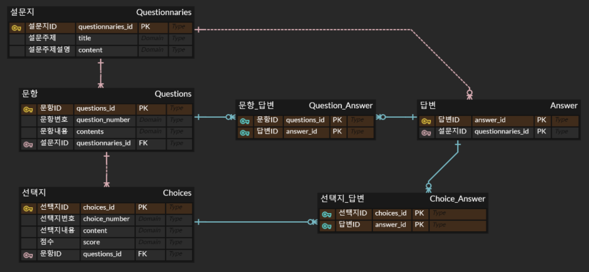

# 마음연구소 기업과제

## 서버 실행 방법

1. `.env` 파일 생성

```bash
$ touch .env
```

2. `.env`파일에 아래 내용 붙혀넣기

```bash
# .env
DB_TYPE=postgres
DB_HOST=maumlab-db.cdsp1srklmtj.ap-northeast-2.rds.amazonaws.com
DB_PORT=5432
DB_NAME=postgres
DB_USER=postgres
DB_PW=postgres
DB_SYNC=true
DB_LOG=true
DB_AUTO_LOAD_ENTITIES=true

PORT_NUMBER=4000
```

3. 종속성 설치

```bash
$ npx yarn install
```

4. 서버 실행

```bash
$ npx yarn start:dev
```

5. 서버 정상 접속 확인

```http
http://localhost:4000/graphql
```

​

---

## ERD 설계



​

---

## 기능 구현

1. 설문지 (Questionnaire)
   - 생성 : createQuestionnaire
   - 전체 조회 : fetchQuestionnaires
   - 단일 조회 : fetchQuestionnaire
   - 수정 : updateQuestionnaire
   - 논리 삭제 : softDeleteQuestionnaire
2. 문항 (Question)
   - 생성 : createQuestion
   - 전체 조회 : fetchQuestions
   - 단일 조회 : fetchQuestion
   - 수정 : updateQuestion
   - 논리 삭제 : softDeleteQuestion
3. 선택지 (Choice)
   - 생성 : createChoice
   - 전체 조회 : fetchChoices
   - 단일 조회 : fetchChoice
   - 수정 : updateChoice
   - 논리 삭제 : softDeleteChoice
4. 답변 (Answer)
   - 생성 - 설문지 완료 : createAnswer
   - 전체 조회 : fetchAnswers
   - 단일 조회 - 완료된 설문지 확인 : fetchAnswer
   - 수정 : updateAnswer
   - 논리 삭제 : softDeleteAnswer
   - 답변 총점 조회 : getAnswerTotalScore

## 설치 패키지

1. `@nestjs/config`
2. `@nestjs/graphql @nestjs/apollo @apollo/server graphql`
3. `typeorm @nestjs/typeorm pg`
